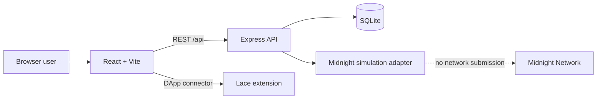

# VeilPay architecture

Status: verified local simulation architecture as of 14 July 2026. The target Midnight layer is not implemented.

## Current runtime

The Vite development server proxies `/api` to the Express backend. The backend binds to `127.0.0.1` by default. SQLite stores employers, employees, payroll batches, payroll items, compliance records, lists, audit logs and withdrawal locks.

## Current flows

Employer:

1. Upload a CSV with `name,wallet_address,amount,department`.
2. Backend validates and normalizes rows, creates a pending batch and generates one high-entropy claim key per item.
3. Employer executes the batch. Simulation returns a `sim_` identifier and the API returns claim keys once in the execution response.
4. Employer distributes keys outside the application.

Employee:

1. Connect Lace; the active address is kept only in application memory.
2. Verify a bearer claim key against its stored hash.
3. Withdraw to the connected address. A database lock prevents concurrent duplicate withdrawals.
4. Simulation marks the item claimed and records a `sim_` transaction identifier.

Compliance:

1. Manage local allowlist and blocklist entries.
2. Evaluate local batch rules and write an audit record.
3. In simulation, proof material is synthetic and is not cryptographic evidence.

## Data boundary

The current SQLite database contains employee names, wallet addresses, departments and salary amounts. Claim payloads are encrypted with AES-256-GCM, while claim lookup values are hashed. This protects neither the process memory nor a running backend with access to the encryption key. Treat the database as sensitive payroll data.

Batch-detail API responses omit claim hashes, encrypted payloads and nullifiers. The project still lacks tenant isolation and route authorization, so it must remain local and use non-production data.

## Target Midnight architecture

The target integration requires all of the following before it is real:

1. Rewrite the Compact drafts against the current official language and standard library.
2. Compile contracts and generate supported TypeScript bindings and proving material.
3. Implement wallet-signed deployment/join and circuit calls using official Midnight packages.
4. Run a reachable proof service and verify generated proofs.
5. Deploy to preprod and persist the real contract address and network configuration.
6. Replace every simulation result with explorer-verifiable transaction state.
7. Add wallet-signature authentication, organization tenancy and role authorization.

See `PROJECT_AUDIT.md` for completion gates.
